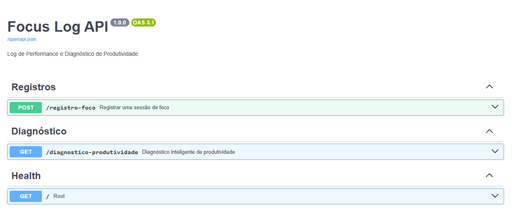
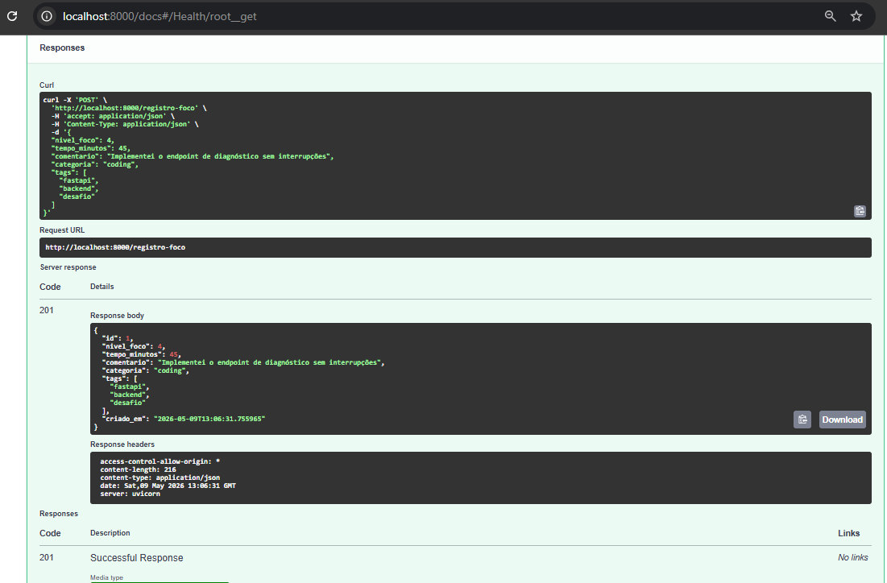
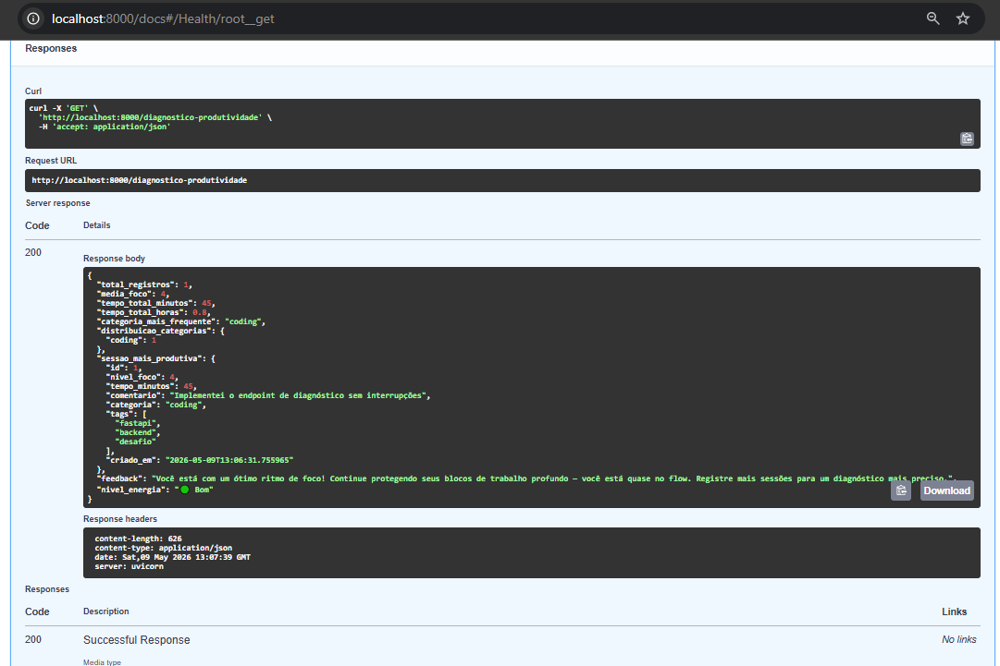

# Focus Log API

API para registrar sessões de trabalho e receber um diagnóstico automático sobre sua produtividade.

---

## O que é isso?

Sabe quando você trabalha o dia inteiro mas sente que não produziu nada? Essa API resolve esse problema.

Você registra cada bloco de trabalho informando quanto tempo trabalhou, o quanto estava concentrado e o que fez. No final, a API analisa todos os registros e te diz como foi sua produtividade — com uma mensagem de feedback personalizada.

---

## Como funciona na prática?

1. Você terminou uma sessão de trabalho de 45 minutos codando? Registra.
2. Ficou 30 minutos em reunião mas com a cabeça em outro lugar? Registra.
3. Quer saber como foi seu dia? Chama o diagnóstico.

A API calcula sua média de foco, tempo total trabalhado e te diz se você está em modo de alta performance ou se precisa rever sua rotina.

---

## Tecnologias utilizadas

| O que faz | Tecnologia |
|---|---|
| Linguagem de programação | Python 3.11+ |
| Framework web | FastAPI |
| Banco de dados | SQLite |
| Validação de dados | Pydantic |
| Servidor | Uvicorn |

---

## Como rodar o projeto

### Pré-requisitos

- Python 3.11 ou superior instalado na máquina
- Terminal (Prompt de Comando, PowerShell ou Terminal do VS Code)

### Passo a passo

**1. Clone o repositório**

```bash
git clone https://github.com/gsabreudev/focus-log-api.git
cd focus-log-api
```

**2. Crie o ambiente virtual**

```bash
python -m venv venv
```

**3. Ative o ambiente virtual**

Windows:
```bash
venv\Scripts\activate
```

Linux/macOS:
```bash
source venv/bin/activate
```

**4. Instale as dependências**

```bash
pip install -r requirements.txt
```

**5. Suba o servidor**

```bash
uvicorn app.main:app --reload
```

**6. Acesse a documentação interativa**

Abra o navegador em: http://localhost:8000/docs

Lá você consegue testar todos os endpoints visualmente, sem precisar de nenhuma ferramenta extra.

---

## Endpoints

### Registrar uma sessão de trabalho

**POST** `/registro-foco`

Você envia os dados de uma sessão que acabou de terminar.

```json
{
  "nivel_foco": 4,
  "tempo_minutos": 45,
  "comentario": "Implementei o endpoint de diagnóstico sem interrupções",
  "categoria": "coding",
  "tags": ["fastapi", "backend"]
}
```

| Campo | Tipo | Obrigatorio | Descricao |
|---|---|---|---|
| nivel_foco | numero | sim | De 1 (muito distraido) a 5 (concentracao total) |
| tempo_minutos | numero | sim | Quanto tempo durou a sessao |
| comentario | texto | sim | O que voce fez ou o que te distraiu |
| categoria | texto | nao | coding, reuniao, estudo, leitura ou geral |
| tags | lista | nao | Palavras-chave da sessao |

Resposta:

```json
{
  "id": 1,
  "nivel_foco": 4,
  "tempo_minutos": 45,
  "comentario": "Implementei o endpoint de diagnóstico sem interrupções",
  "categoria": "coding",
  "tags": ["fastapi", "backend"],
  "criado_em": "2026-05-09T13:06:31"
}
```

---

### Ver o diagnóstico de produtividade

**GET** `/diagnostico-produtividade`

Analisa todos os registros e retorna um resumo completo do seu período de trabalho.

```json
{
  "total_registros": 3,
  "media_foco": 3.8,
  "tempo_total_minutos": 120,
  "tempo_total_horas": 2.0,
  "categoria_mais_frequente": "coding",
  "distribuicao_categorias": {
    "coding": 2,
    "reuniao": 1
  },
  "sessao_mais_produtiva": { ... },
  "feedback": "Você está com um ótimo ritmo de foco! Continue protegendo seus blocos de trabalho profundo.",
  "nivel_energia": "Bom"
}
```

O campo `feedback` muda de acordo com sua média de foco:

| Media de foco | Mensagem |
|---|---|
| Abaixo de 2 | Sugere eliminar distrações e trabalhar em blocos menores |
| Entre 2 e 3 | Sugere pausas mais longas e revisão de prioridades |
| Entre 3 e 4 | Aponta o que diferencia suas boas sessões das ruins |
| Entre 4 e 4.5 | Parabeniza e incentiva manter o ritmo |
| Acima de 4.5 | Reconhece estado de alta performance |

---

## Estrutura do projeto

```
focus-log-api/
├── app/
│   ├── main.py          # Configuracao da API
│   ├── database.py      # Conexao com o banco de dados
│   ├── models.py        # Estrutura dos dados no banco
│   ├── schemas.py       # Validacao dos dados de entrada e saida
│   ├── services.py      # Logica de negocio e calculo do diagnostico
│   └── routes/
│       ├── registro.py      # Endpoint de registro de sessao
│       └── diagnostico.py   # Endpoint de diagnostico
├── requirements.txt
├── .gitignore
└── README.md
```
## A API em funcionamento

Visão geral dos endpoints disponíveis:


Registrando uma sessão de trabalho com nivel de foco 4:


Diagnóstico gerado automaticamente com feedback e nivel de energia:

---

## Uso de Inteligência Artificial

Este projeto foi desenvolvido com auxílio do Claude (Anthropic) para geração da estrutura inicial, sugestões de boas práticas e redação da documentação. Todo o código foi revisado e compreendido pelo desenvolvedor antes de ser submetido.

---

## Autor

Gabriela — [LinkedIn](https://www.linkedin.com/in/abreugs/)

---

## Para quem está apredendo...

### O que é FastAPI?
É um framework Python pra criar APIs. Framework é como uma caixa de ferramentas pronta, em vez de construir tudo do zero, você usa o que já existe. O FastAPI é conhecido por ser rápido e por gerar a documentação automática (aquela tela do Swagger que você viu).

### Por que usou SQLite e não PostgreSQL?
SQLite é um banco de dados que fica salvo num arquivo no próprio computador, sem precisar instalar nada. PostgreSQL é mais robusto, usado em produção com muitos usuários. Como esse projeto é um desafio técnico simples, o SQLite é suficiente e mais fácil de rodar localmente.

### O que é um endpoint POST?
Endpoint é um endereço da API. O POST é usado quando você quer enviar dados no nosso caso, enviar os dados de uma sessão de trabalho. Já o GET é usado quando você quer buscar dados no nosso caso, buscar o diagnóstico.

### O que faz o arquivo services.py?
É onde fica a lógica do negócio. Por exemplo, o cálculo da média de foco, a soma do tempo total e a geração do feedback automático ficam todos lá. A ideia é separar a lógica das rotas pra o código ficar mais organizado e fácil de testar.

### O que é Pydantic?
É uma biblioteca que valida os dados que chegam na API. Por exemplo, se alguém mandar nivel_foco: 10, o Pydantic rejeita automaticamente porque o valor tem que ser entre 1 e 5. Isso evita que dados errados entrem no banco.
